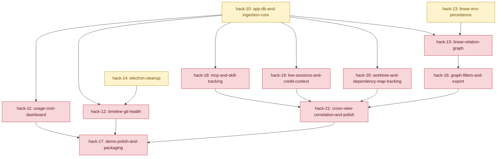

# Hackathon Dependency Map

This is the canonical dependency DAG for this repo.

## Rules
- A task is unblocked only when all its dependencies are `done`.
- Keep this file as the source of truth for ordering.
- This map tracks dependency and status only.
- For git worktree operations, use `WORKTREE.md`.
- For workspace operating guidance, use `../AGENTS.md`.

## Status Keys
- `todo`
- `inprog`
- `done`
- `blocked`

## DAG (Mermaid)

