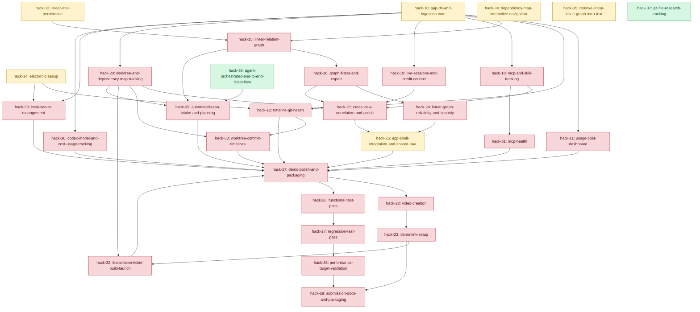

# Hackathon Dependency Map

This is the canonical dependency DAG for this repo.

## Rules
- A task is unblocked only when all its dependencies are `done`.
- Keep this file as the source of truth for ordering.
- This map tracks dependency and status only.
- Priority, assignment, and Linear sync/color conventions are enforced by the `start-feature-flow` and `finish-feature-flow` skills.
- For git worktree operations, use `WORKTREE.md`.
- For workspace operating guidance, use `../AGENTS.md`.

## Status Keys
- `todo`
- `inprog`
- `done`
- `blocked`

## Status Color Standard
- `todo`: gray (`#6c757d`)
- `inprog`: amber (`#b58900`)
- `done`: green (`#1e8e3e`)
- `blocked`: red (`#b02a37`)

## DAG (Mermaid)

