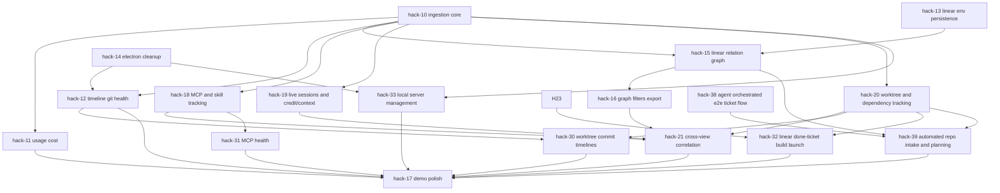

# Hackathon Master Play

Status: Draft v1 (single source of truth for build + execution)
Owner: Team
Scope window: Hackathon build

## 1) Product Narrative

Build a local-first Electron app that makes Codex work visible and controllable:

1. Monitor local Codex usage, tokens, model mix, and estimated cost.
2. Correlate AI activity with git activity as a unified timeline.
3. Visualize Linear execution graph as an interactive Mermaid DAG.
4. Keep all sensitive data local by default.

This project has two hack tracks that run in parallel:

1. Track A: Local Codex Monitor (telemetry + git + health).
2. Track B: Linear Mermaid Graph (issue DAG + inspection).

## 2) Success Criteria

The hack is successful if all of the following are true:

1. Fresh install to working demo in under 60 seconds.
2. User can load local Codex data and see timeline + usage + cost estimate.
3. User can load Linear issues by team and interact with issue DAG.
4. Demo shows one end-to-end story from prompt activity to git activity to Linear planning.
5. No cloud backend required for MVP.

## 3) Scope

## 3.1 In Scope (MVP)

1. Electron desktop app with local data ingestion.
2. Codex app-server start/stop + logs panel.
3. Codex telemetry parsing from local files.
4. Git activity collection from local repos.
5. Overview, Timeline, Usage, Git, Health screens.
6. Linear issue graph panel using Mermaid with issue details panel.
7. Graph filters and relation toggles.
8. Local settings persistence (`.env` and app DB).
9. Export timeline/usage (CSV/JSON) and graph (Mermaid text/SVG).
10. MCP server usage tracking and visibility.
11. Skill usage tracking and visibility.
12. Live session tracking (active/idle/recent).
13. Credit/rate-limit usage tracking.
14. Context management metrics (usage and pressure).
15. Worktree tracking and status snapshots.
16. Dependency map tracking and progress view.
17. Worktree commit timeline view.
18. MCP health diagnostics and status scoring.
19. Linear done-ticket to local build-launch flow.
20. Managed local server lifecycle (start/stop/remove).
21. Automated repository intake flow (clone repo, deep research, Linear planning board creation, and dependency map generation).

## 3.2 Out of Scope (Hackathon)

1. GitHub OAuth UI flow and long-lived token brokerage.
2. Invoice-grade billing accuracy claims.
3. Full graph editing or drag-drop node authoring.
4. Multi-user cloud sync backend.
5. General-purpose bi-directional Linear editing outside the automated onboarding flow.

## 4) Current Baseline

Current code in `Monitor/` already has:

1. Electron app shell.
2. Codex app-server process control and logs.
3. Linear GraphQL fetch by team key.
4. Mermaid rendering for parent -> child relationships.
5. Clickable node details panel.
6. `.env` persistence branch already in parallel worktree variants.

## 5) Target Architecture

## 5.1 Runtime Components

1. Main process:
   1. Codex server process manager.
   2. Local collectors (Codex + git).
   3. Persistence (SQLite + `.env` settings).
   4. IPC contract to renderer.
2. Renderer process:
   1. Dashboard UI and filters.
   2. Timeline + charts.
   3. Linear Mermaid graph + details panel.
3. Local data sources:
   1. `~/.codex/history.jsonl`
   2. `~/.codex/sessions/**/*.jsonl`
   3. `~/.codex/state_5.sqlite`
   4. Local git repositories.
   5. GitHub API (repo metadata + open issues) when credentials are provided.
   6. Linear GraphQL API (read for graph + scoped write for onboarding automation).

## 5.2 Data Stores

1. App DB (`monitor.sqlite`):
   1. `timeline_events`
   2. `token_usage_rollups`
   3. `ingest_state`
   4. `linear_nodes`
   5. `linear_edges`
   6. `settings`
   7. `mcp_activity`
   8. `skill_activity`
   9. `live_sessions`
   10. `rate_limit_snapshots`
   11. `context_usage_rollups`
   12. `worktree_snapshots`
   13. `dependency_items`
   14. `dependency_edges`
   15. `worktree_commit_events`
   16. `mcp_health_snapshots`
   17. `build_snapshots`
   18. `managed_servers`
2. `.env`:
   1. `LINEAR_API_KEY`
   2. `LINEAR_TEAM_KEY`

## 6) Canonical Data Contracts

## 6.1 Timeline Event

```ts
type TimelineEvent = {
  id: string;                // deterministic hash
  ts: number;                // unix seconds
  source: "codex" | "git" | "system" | "linear";
  repoPath?: string | null;
  worktreePath?: string | null;
  branch?: string | null;
  eventType: string;         // e.g. prompt, tool_call, commit, merge, branch_switch
  title: string;
  detailsJson: string;       // serialized JSON
  sessionId?: string | null;
  threadId?: string | null;
  sha?: string | null;
};
```

## 6.2 Token Rollup

```ts
type TokenRollup = {
  bucketStartTs: number;     // 1h bucket
  model: string;
  inputTokens: number;
  cachedInputTokens: number;
  outputTokens: number;
  reasoningTokens: number;
  totalTokens: number;
  estimatedCostUsd: number;
};
```

## 6.3 Linear Graph Model

```ts
type LinearNode = {
  id: string;                // Linear issue UUID
  identifier: string;        // ENG-123
  title: string;
  url: string;
  stateName?: string | null;
  stateType?: string | null; // backlog|unstarted|started|completed|canceled
  priority?: number | null;  // 0..4
  assigneeName?: string | null;
  updatedAt?: string | null;
  teamKey?: string | null;
};

type LinearEdge = {
  id: string;                // deterministic hash(from,to,type)
  fromIssueId: string;
  toIssueId: string;
  relationType: "parent_child" | "blocks" | "blocked_by" | "related" | "duplicate";
};
```

## 6.4 Observability Models (MCP, Skills, Sessions, Credits, Context, Dependencies)

```ts
type McpActivity = {
  id: string;                // hash(threadId, ts, server, tool)
  ts: number;
  threadId?: string | null;
  sessionId?: string | null;
  serverName: string;        // e.g. linear, github, filesystem
  toolName: string;          // e.g. list_issues, read_resource
  status: "success" | "error";
  latencyMs?: number | null;
};

type SkillActivity = {
  id: string;                // hash(threadId, ts, skillName)
  ts: number;
  threadId?: string | null;
  sessionId?: string | null;
  skillName: string;         // from AGENTS/turn instructions
  source: "declared" | "inferred";
};

type LiveSession = {
  threadId: string;
  lastSeenTs: number;
  state: "active" | "idle" | "ended";
  cwd?: string | null;
  gitBranch?: string | null;
  model?: string | null;
  tokensUsed?: number | null;
};

type CreditSnapshot = {
  id: string;                // hash(ts, limitId, threadId)
  ts: number;
  threadId?: string | null;
  limitId?: string | null;
  hasCredits?: boolean | null;
  unlimited?: boolean | null;
  balance?: number | null;
  remainingPct?: number | null;
  resetTs?: number | null;
};

type ContextUsageRollup = {
  bucketStartTs: number;     // 1h bucket
  model: string;
  inputTokens: number;
  outputTokens: number;
  reasoningTokens: number;
  avgContextPressurePct: number; // estimated against configured context window
};

type DependencyItem = {
  id: string;                // task id from DEPENDENCY_MAP
  label: string;
  status: "todo" | "inprog" | "done" | "blocked";
  owner?: string | null;
};
```

## 7) Linear Integration Contract (Mermaid Track)

## 7.1 Functional Requirements

1. User enters API key + team key and clicks load.
2. App fetches all issues (paginated) for team.
3. App builds graph nodes and edges for relation types:
   1. parent/sub-issue
   2. blocks
   3. blocked-by
   4. related
   5. duplicate
4. App renders Mermaid flowchart with per-state node styling and per-relation edge styling.
5. Node click opens details panel with deep link to Linear.
6. User can filter by state/assignee/relation/search.
7. User can export Mermaid source and rendered SVG.

## 7.2 GraphQL Implementation Notes

1. Start with schema-safe query approach:
   1. query minimal fields already known in existing code.
   2. add relation fields incrementally.
2. If relation field names differ by Linear schema version:
   1. run introspection query for `Issue` relation fields.
   2. adapt mapper in one place (`normalizeLinearIssue`).
3. Use pagination (`first: 100`, `after`) until complete.
4. De-duplicate edges with deterministic ID hash.
5. Protect renderer with strict output escaping for labels and attributes.

## 7.3 Mermaid Rules

1. Use `mermaid.render()` API only (already in place).
2. Keep `securityLevel: "loose"` for click callbacks in MVP.
3. Use `ELK` renderer; fall back to `dagre` if ELK fails.
4. Cap default render to N nodes (for responsiveness) and warn user when truncated.

## 8) Execution Plan By Track

## 8.1 Track A: Codex Monitor

### A1 - Ingestion Backbone

1. Build collectors for history/session/state sqlite/git.
2. Normalize and insert into app DB idempotently.
3. Persist cursors in `ingest_state`.

Definition of done:

1. Re-running ingest does not duplicate records.
2. At least one codex session and one git repo appear in timeline.

### A2 - Usage + Cost

1. Parse token_count events from session logs.
2. Add settings pricing table by model.
3. Compute cost estimate by bucket and totals.

Definition of done:

1. Overview card shows "Estimated cost from local telemetry".
2. Usage screen shows model mix and token trend.

### A3 - Timeline + Git + Health

1. Timeline filters (`repo`, `branch`, `source`, `event`, `time`).
2. Git panel (`dirty`, `ahead/behind`, worktrees, branch summary).
3. Health panel (`freshness`, parser error rate, runtime status).

Definition of done:

1. Filter interactions return in under 150ms on typical local dataset.
2. Health state reflects ingest/runtime failures.

## 8.2 Track B: Linear Mermaid

### B1 - Data Expansion

1. Extend issue query for relation edges.
2. Build `LinearNode[]` and `LinearEdge[]`.
3. Store last loaded graph in app DB for quick reload.

Definition of done:

1. All relation types render when present.
2. Graph survives app restart without immediate refetch (cache read).

### B2 - UI Interactivity

1. Add filter controls (state, assignee, relation, search).
2. Add legend and relation toggle chips.
3. Add export actions (copy Mermaid, download SVG).

Definition of done:

1. Node click always maps to details panel.
2. Filter changes re-render graph in under 500ms for typical team dataset.

### B3 - Reliability + Security

1. Keep API key in `.env` and never log secret value.
2. Add error states for auth failure, team not found, empty graph.
3. Guard against malformed labels and unsafe links.

Definition of done:

1. Invalid key returns clear status message.
2. No secret appears in renderer logs or UI text.

## 8.3 Track C: Session Intelligence (MCP, Skills, Credits, Context, Worktrees, Dependencies)

### C1 - Live Session Tracking

1. Build live session detector from:
   1. `state_5.sqlite.threads.updated_at`
   2. recent log events by `thread_id`
   3. optional lock/file-activity hints
2. Classify sessions (`active`, `idle`, `ended`) with time thresholds.
3. Add live sessions panel with auto-refresh (5-10s polling).

Definition of done:

1. Live panel shows active sessions with `cwd`, `branch`, and last-seen timestamp.
2. Session state transitions are visible without app restart.

### C2 - Credits and Rate-Limit Tracking

1. Parse `token_count` events and capture `rate_limits` payload fields.
2. Persist snapshots and compute per-model/per-thread summaries.
3. Add credits/rate-limit widgets and trend timeline.

Definition of done:

1. User can view credit-related fields when present.
2. Rate-limit pressure warnings appear when remaining percent is low.

### C3 - Context Management Tracking

1. Add per-model context-window config table in settings.
2. Compute context pressure estimates:
   1. per turn (`tokens_used / context_window`)
   2. per hour rollups (`avg`, `p95`)
3. Add context panel with high-pressure alerts.

Definition of done:

1. Context pressure is visible per model and over time.
2. Alerts trigger when estimated pressure crosses threshold.

### C4 - MCP and Skill Tracking

1. Parse tool-call events to identify MCP usage (`server`, `tool`, `status`, `latency`).
2. Parse skill signals:
   1. declared usage from instructions (e.g. skill mentions)
   2. inferred usage heuristics from tool patterns
3. Add MCP/Skills panel:
   1. top servers/tools
   2. top skills
   3. usage over time

Definition of done:

1. MCP activity is queryable by server/tool/time.
2. Skill usage is shown with explicit confidence (`declared` vs `inferred`).

### C5 - Worktree and Dependency Map Tracking

1. Collect `git worktree list --porcelain` snapshots on ingest.
2. Track per-worktree status:
   1. branch
   2. path
   3. dirty state
   4. ahead/behind
3. Parse `Monitor/DEPENDENCY_MAP.md` into `dependency_items` and `dependency_edges`.
4. Add dependency panel with status counts and blocked-chain visibility.

Definition of done:

1. Worktree panel reflects current local worktrees and health.
2. Dependency panel reflects statuses in `Monitor/DEPENDENCY_MAP.md`.

### C6 - Worktree Commit Timelines

1. Build per-worktree commit timeline using local git history + reflog context.
2. Correlate commit events to Codex sessions and dependency-map task IDs where possible.
3. Add timeline controls for worktree and branch drill-down.

Definition of done:

1. User can open a selected worktree and see commit sequence over time.
2. Timeline supports at least branch/worktree/date filters with sub-second local query response.

### C7 - MCP Health

1. Compute MCP health rollups by server:
   1. success rate
   2. error rate
   3. p50/p95 latency
   4. recent failure streaks
2. Add MCP health indicators and warning thresholds in the MCP + Skills surface.
3. Add health-driven status text for degraded/unavailable MCP servers.

Definition of done:

1. MCP health is visible per server with trend and current status.
2. Warning state appears when error rate or latency crosses threshold.

### C8 - Linear Done-Ticket Build Launch

1. Attach local build snapshot metadata to tracked tasks (path, timestamp, commit SHA, task ID).
2. In Linear graph/details view, add action for completed issues to open/launch matching local build snapshot.
3. If no matching build exists, show explicit fallback guidance.

Definition of done:

1. Clicking a done issue can launch/open the mapped local build snapshot when available.
2. Missing-build cases are handled with clear UI messaging (no silent failures).

### C9 - Managed Local Servers

1. Track managed local servers in app settings/state (name, command, status, last run).
2. Add controls to start, stop, and remove local server entries.
3. Ensure removal cleans persisted metadata and stops running process if active.

Definition of done:

1. User can remove a managed server from the app UI in one flow.
2. Removed servers no longer appear in status, logs, or persisted settings.

### C10 - Automated Repo Intake and Planning

1. User provides:
   1. GitHub repository URL
   2. target branch/ref (optional)
   3. Linear team/project naming overrides (optional)
2. Intake service clones the repository to a local onboarding workspace path.
3. A research agent runs X-High depth analysis over:
   1. source layout and build files
   2. docs/README and contribution guidance
   3. open GitHub issues and labels
4. A planning agent emits structured artifacts:
   1. epics and implementation tickets
   2. dependency edges and blocker chains
   3. execution notes and risk flags
5. Linear sync provisions a board/project, creates tickets, and creates blocker relations from the dependency edges.
6. Dependency map generator writes a repo-scoped DAG file at `Monitor/dependency_maps/<repo-slug>.md`.
7. A summary record appends the onboarded repo and generated artifact links to this master play.

Implementation slices (required order):

1. Slice 0 - Task lifecycle bootstrap:
   1. use `start-feature-flow` to activate `hack-39` and create/resume worktree context
   2. record assumptions and target repo in issue comment
2. Slice 1 - Dry-run pipeline:
   1. clone repository
   2. run X-High research agent
   3. emit artifacts only (`plan.json`, `tickets.json`, `dependencies.json`, dependency-map markdown)
   4. no Linear writes in this slice
3. Slice 2 - Linear provisioning + sync:
   1. create/update project/board
   2. upsert tickets using stable IDs (`<repo-slug>-NN`)
   3. upsert blocker relations from dependency edges
4. Slice 3 - Local execution handoff:
   1. generate local implementation queue from dependency map
   2. support `start-feature-flow` handoff for first executable ticket
5. Slice 4 - Validation + closure:
   1. run automated tests and Electron Playwright scenario
   2. use `create-pr-flow` to prepare review package
   3. use `finish-feature-flow` to close/sync status after validation

Testing requirements for C10:

1. Contract tests for input normalization and repo-slug/idempotency-key generation.
2. Integration tests for clone + research artifact generation.
3. Integration tests for Linear upsert idempotency (rerun does not duplicate tickets or blocker links).
4. Electron Playwright end-to-end test:
   1. launch Monitor
   2. submit onboarding inputs
   3. wait for completion state
   4. verify generated dependency-map file exists and is parseable
   5. verify Linear ticket count and blocker links match generated edges
5. Capture verification artifacts for meaningful UI changes (Playwright JSON + screenshot + short notes).

Definition of done:

1. A single local command can onboard a public repository from URL to Linear ticket graph with blocker links.
2. Generated Linear tickets carry stable task IDs (`<repo-slug>-NN`) and are grouped into a dedicated project/board.
3. A repo-specific dependency map file is generated and parseable by Monitor.
4. Rerunning onboarding for the same repo slug updates existing records instead of duplicating tickets.
5. Required skill workflow (`start-feature-flow` -> `create-pr-flow` -> `finish-feature-flow`) is reflected in task lifecycle updates.
6. Electron Playwright onboarding scenario passes and artifacts are stored with task verification notes.

## 9) Integration Plan (Track A + Track B + Track C)

1. Add a shared top-level nav with screens:
   1. Overview
   2. Timeline
   3. Live Sessions
   4. Usage
   5. Credits + Context
   6. MCP + Skills
   7. Git + Worktrees
   8. Dependency Map
   9. Linear Graph
   10. Health
   11. Settings
   12. Build Snapshots
   13. Server Manager
2. Standardize status/notification component for all panels.
3. Share settings storage and load lifecycle.
4. Add a unified "last refresh" timestamp in header.

## 10) Worktree and Ownership Plan

Follow `Monitor/WORKTREE.md` and keep one active worktree per task.

Proposed task IDs:

1. `hack-10` app-db-and-ingestion-core
2. `hack-11` usage-cost-dashboard
3. `hack-12` timeline-git-health
4. `hack-13` linear-env-persistence (already created)
5. `hack-14` electron-cleanup (already created)
6. `hack-15` linear-relation-graph
7. `hack-16` graph-filters-and-export
8. `hack-17` demo-polish-and-packaging
9. `hack-18` mcp-and-skill-tracking
10. `hack-19` live-sessions-and-credit-context
11. `hack-20` worktree-and-dependency-map-tracking
12. `hack-21` cross-view-correlation-and-polish
13. `hack-30` worktree-commit-timelines
14. `hack-31` mcp-health
15. `hack-32` linear-done-ticket-build-launch
16. `hack-33` local-server-management
17. `hack-39` automated-repo-intake-and-planning

## 11) Dependency DAG



## 12) Testing and Verification

## 12.1 Functional Tests

1. Codex server start/stop and log streaming works.
2. Ingestion can parse real local data and survive malformed lines.
3. Timeline filters return correct subsets.
4. Live sessions panel reflects active/idle/ended transitions.
5. MCP usage panel shows server/tool activity and statuses.
6. Skill usage panel shows declared/inferred entries.
7. Credits/rate-limit panel shows parsed fields when present.
8. Context panel shows pressure metrics and alerts.
9. Worktree panel reflects branch/path/dirty/ahead-behind.
10. Dependency map panel reflects parsed status and edges.
11. Linear load works with valid key/team.
12. Graph renders and node click details work.
13. Export actions generate valid outputs.
14. Worktree commit timeline renders and filters correctly.
15. MCP health status reflects server reliability and latency.
16. Done-ticket build launch action opens mapped local build (or shows fallback message).
17. Managed local server can be removed safely and stays removed after restart.
18. Automated repo intake can create Linear tickets/blockers and generate a repo dependency map from a GitHub URL.
19. Electron Playwright onboarding test validates end-to-end clone -> research -> Linear sync -> dependency-map generation.
20. Re-running onboarding from the same input updates existing Linear entities without duplicates.
21. Onboarding failure paths (invalid repo URL, missing credentials, API errors) show clear status messaging in app UI.

## 12.2 Regression Tests

1. Re-run ingestion: no duplicate rows.
2. Restart app: persisted settings restored.
3. Empty/no-data environment: app shows demo/empty states.
4. Missing optional telemetry fields do not break parsing.
5. Dependency map parser tolerates partial/incomplete Mermaid definitions.
6. Onboarding rerun remains idempotent after app restart.
7. Existing dependency-map parsing and Linear graph loading remain stable when repo-specific maps are added.

## 12.3 Performance Targets

1. Initial UI load on cached data: under 2s.
2. Timeline filter updates: under 150ms typical dataset.
3. Graph render for ~500 issues: under 3s.
4. Live sessions panel refresh: under 1s query time per poll.
5. Credits/context computations: under 300ms for one-day window.

## 13) Demo Script (2 minutes)

1. Open app and show local-first statement.
2. Start Codex app-server and show live logs.
3. Open Live Sessions and show active thread state and transitions.
4. Open Usage and Credits + Context (tokens, cost estimate, rate-limit/pressure).
5. Open MCP + Skills and show top servers/tools/skills.
6. Open Timeline and filter to one repo and one hour.
7. Open Git + Worktrees and show worktree/branch health.
8. Open Dependency Map and show blocked chain visibility.
9. Open Linear Graph, load team, click through issue chain.
10. Open a done issue and launch the mapped local build snapshot.
11. Show MCP + Skills health warnings/latency status.
12. Remove a managed local server and verify status updates.
13. Show export to SVG/Mermaid.
14. Show Health panel and finish with clear value proposition.
15. Run automated repo onboarding for one sample repo and show generated tickets/blockers + dependency map.

## 14) Submission Checklist

1. Public repo with README quickstart.
2. Short architecture section and privacy notes.
3. 2-minute demo video.
4. Demo script in repo.
5. Known limitations section.

## 15) Risks and Mitigations

1. Linear relation schema mismatch:
   1. Mitigation: introspect and normalize centrally.
2. Large local history causing slow ingest:
   1. Mitigation: incremental cursors and batched inserts.
3. Cost mismatch vs actual bill:
   1. Mitigation: explicit estimate labeling and configurable pricing table.
4. Graph complexity hurts readability:
   1. Mitigation: relation toggles, search, state filters, truncation warnings.
5. Skill detection can be noisy:
   1. Mitigation: separate `declared` vs `inferred` and expose confidence.
6. Missing credit fields in some sessions:
   1. Mitigation: nullable schema and "field unavailable" UI states.
7. Large/legacy repositories can produce noisy ticket plans:
   1. Mitigation: cap first-pass ticket count, then stage expansions by module.
8. Creating Linear tickets automatically can duplicate prior work:
   1. Mitigation: idempotency key by repo slug + branch + plan hash before write operations.
9. Electron Playwright onboarding tests can be flaky with async graph renders:
   1. Mitigation: gate assertions on explicit UI status signals and persisted output existence.

## 16) Decision Log

1. Keep Electron + current JS stack for hackathon speed.
2. Keep Mermaid for graph MVP, defer React Flow migration.
3. Keep all sensitive data local, no backend service in MVP.
4. Treat this file as execution source of truth for scope and dependencies.
5. Add agent-driven GitHub -> Linear onboarding as a scoped automation path.
